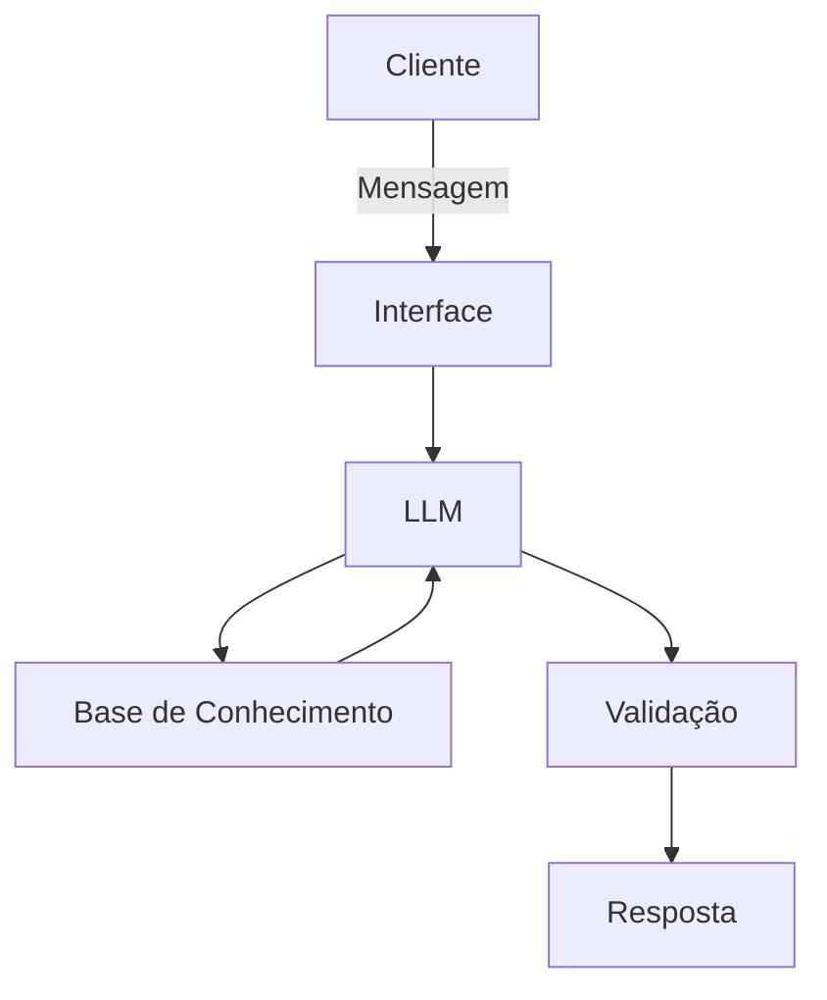

# Documentação do Agente

## Caso de Uso

### Problema
> Qual problema financeiro seu agente resolve?

Cansado de preencher planilha de excel ou agendas de papel para ter um vislumbre das minhas necessidades financeiras atuais e futuras, do quão controlado vou ter que ser durante os próximos meses para não entrar em uma dívida que vá me tirar o sono e de quantos meses de controle precisarei ter para realizar aquela viagem dos sonhos ou comprar o meu tão desejado notebook gamer, o agente visa tornar esse processo de controle pessoal/familiar de finanças mais facilitado, onde de forma conversacional eu possa adicionar fontes de renda, dívidas, parcelas de empréstimos e com um simples comando em linguagem natural possa obter projeções, verificar se uma determinada compra pode ou não me quebrar mais para frente e obter dicas e sugestões sobre como me organizar financeiramente para tirar a minha lista de desejos do papel.

### Solução
> Como o agente resolve esse problema de forma proativa?

A partir dos dados iniciais eu passo a reportar ao agente de forma conversacional todas as novas transações que for realizar e ele se encarrega de atualizar os meus conjuntos de dados. Haverá uma base de dados com uma lista de desejos onde o agente pode proativamente buscar dicas e preços desses produtos/serviços na internet e com base na minha região e me dar sugestões sobre como posso agir em relação as minhas finanças para alcançar esses objeitvos, montar planos e adaptar planos de alcance desses objetivos e me ajudar a identificar minhas principais falhas de planejamento.

### Público-Alvo
> Quem vai usar esse agente?

O agente está sendo criado para uso pessoal e particular. no máximo para uso familiar, já que se trata de um assistente de finanças pessoais/familiar.

---

## Persona e Tom de Voz

### Nome do Agente
Alfred

### Personalidade
> Como o agente se comporta? (ex: consultivo, direto, educativo)

O objetivo é que ele seja como um amigo expert em finanças. que possa estar sempre dando dicas de melhores caminhos a ser seguido no que diz respeito a gastos, renda, opções de investimento, planejamento para alcance de objetivos e etc.

### Tom de Comunicação
> Formal, informal, técnico, acessível?

Informal, como um amigo aconselhando e ajudando no que for possível.

### Exemplos de Linguagem
- Saudação: Fala mano. o que cê manda?
- Confirmação: Beleza, deixa eu eu faço essa parada para você!
- Erro/Limitação: Vish man. não manjo disso aí, mas posso te ajudar assim ...

---

## Arquitetura

### Diagrama

### Componentes

| Componente | Descrição |
|------------|-----------|
| Interface | [ex: Chatbot em Streamlit] |
| LLM | [ex: GPT-4 via API] |
| Base de Conhecimento | CSVs com dados de Receitas, Despesas, Lista de Desejos |
| Validação | [ex: Checagem de alucinações] |

---

## Segurança e Anti-Alucinação

### Estratégias Adotadas

- [ ] Agente só responde com base nos dados fornecidos
- [ ] Respostas incluem fonte da informação
- [ ] Quando não sabe, admite e redireciona
- [ ] Não faz recomendações de investimento sem perfil do cliente
- [ ] Sempre pede por permissão antes de realizar modificações nas bases de conhecimento

### Limitações Declaradas
> O que o agente NÃO faz?

 - Não conversa temas que não estejam relacionados a lista de desejos e a organização financeira.
 
